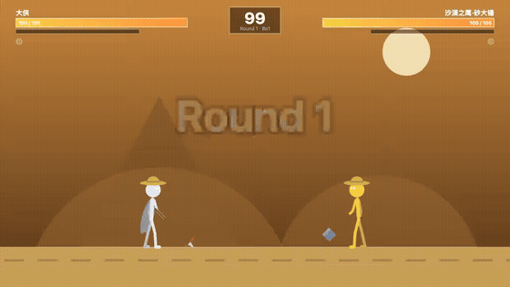

# 火柴人武林大会 · Stickman Kungfu Arena

一个纯前端（HTML5 Canvas + 原生 JavaScript，零依赖、零外部素材）的火柴人格斗游戏。
音效与背景音乐全部由 WebAudio 实时合成，双击即玩，可离线运行。

> 🎮 **在线试玩**：<https://caiqing.github.io/stickman-arena/> —— 家人扫码/点链接即开即玩，无需安装

## 🎬 精彩对局



*🤖 托管 AI 持红缨长枪，大漠决战 Boss「沙漠之鹰·砂大锤」（115 血力量型）。[下载完整视频](media/boss-fight.mp4) · [▶ 观看可交互回放](https://caiqing.github.io/stickman-arena/#r=SGA1.eyJ2IjoxLCJtIjoi5pWF5LqLwrflpKfmvKDCt+aymeS5i+W3qOaxiSIsInIiOiLmlYXkuovmqKHlvI/vvJrlpKfkvqAg6IOcIiwiZCI6MjUsInMiOiJkZXNlcnQiLCJ3IjoxLCJwMSI6eyJuIjoi5aSn5L6gIiwiYyI6eyJjb2xvciI6IndoaXRlIiwiaGFpciI6Im5vbmUiLCJoYXQiOiJzdHJhdyIsImNsb3RoZXMiOiJjYXBlIiwid2VhcG9uIjoic3BlYXIiLCJnZWFyIjoiYm9vdHMiLCJuYW1lIjoi5aSn5L6gIn19LCJwMiI6eyJuIjoi5rKZ5ryg5LmL6bmwwrfnoILlpKfplKQiLCJjIjp7ImNvbG9yIjoieWVsbG93IiwiaGFpciI6Im5vbmUiLCJoYXQiOiJzdHJhdyIsImNsb3RoZXMiOiJiZWx0Iiwid2VhcG9uIjoiaGFtbWVyIiwiZ2VhciI6Im5vbmUifX0sImYiOlswLDEyOCw4MywwLDEsNiwwLDY1LDEsMCwxLDExLDYsMSwxLDAsMSwxMSwwLDUsMSwwLDAsMTksMiwwLDUsMiwxLDExLDMyLDEsMSwwLDEsOSwxLDEsMTcsMSwyLDcsMTYsMiwxLDAsMiwxMywxNiw4LDEsMCw4LDEzLDEsOCwxMSwxLDE2LDEsMSwwLDEsOCwwLDI2LDgsMzIsMSw4LDAsMjUsOCwzMiwxLDgsMCwyNSw4LDMyLDEsOCwwLDEsMTYsMCwxLDAsMCw3LDE2LDAsMSwwLDAsNywwLDE2LDEsMCwwLDIsMTYsMCwxLDAsMCwxLDAsOCwxMSwxNiw4LDIsMCw4LDYsMCwyLDcsOCwyLDEyLDIsMiwxMywyLDgsMTQsOCw4LDEzLDgsMSw3LDE2LDEsMSwwLDEsNywwLDE2LDEsMCwwLDE0LDMyLDAsMSwwLDAsNSwwLDgsMTEsMiw4LDQsMzIsOCwxLDAsOCwxMSw4LDgsMSw4LDEsMSw4LDMyLDEsOCwwLDIwLDE2LDAsMSwwLDAsMTEsMiwwLDEsMiwxNiwxLDIsMSw0Miw4LDEsMzEsOCwzMiwxLDgsMCwxNyw4LDE2LDEsOCwwLDEyLDgsMTYsMSw4LDAsNyw4LDMyLDEsOCwwLDIyLDgsMzIsMSw4LDAsNSwxNiwwLDEsMCwwLDEyLDAsMSwxLDgsMSwyMCwzMiwxLDEsMCwxLDExLDEsMSwxOSwxLDIsNCwzMiwyLDEsMCwyLDUsMCwzMiwxLDAsMCw2LDMyLDAsMSwwLDAsMTcsMCw4LDUsMTYsOCwxLDAsOCwxMSwzMiw4LDEsMCw4LDgsMCwyLDIsMCwzMiwxLDAsMCwyLDgsMCwxNCw4LDgsMzAsOCwxNiwxLDgsMCwxOSwxNiwwLDEsMCwxLDIwLDMyLDEsMSwwLDEsMTksMzIsMSwxLDAsMSwxMywwLDgsMyw4LDgsMjEsMSw4LDIsMSwyLDgsMzIsMiwxLDAsMiw2LDAsMzIsMSwwLDAsMSw4LDAsMjIsOCwzMiwxLDgsMCwyLDE2LDAsMSwwLDAsNiwwLDI1NiwxLDAsMCwxLDAsMjU2LDIsMCwwLDUsMCwyNTYsMjEsMCwwLDEsMiwwLDEyLDIsNiw1LDEsNiwyNSwxLDIsMiw2NSwyLDEsMSwyLDI3LDY1LDEyOCwxLDEsMTI4LDUsNSwxMjgsMTUsNSwwLDQsMSwwLDE5LDEsMiw2LDY1LDIsMSwxLDIsMjIsMzIsMiwxLDAsMiw1LDAsMzIsMSw4LDAsMjAsOCw4LDEsMjU2LDgsMiwwLDgsMSw4LDgsMywyNTYsOCwxLDAsOCwyLDI1Niw4LDEsMCw4LDMsMjU2LDgsMSwwLDgsMSwyNTYsOCwzLDAsOCwyLDI1Niw4LDMsMiwyLDIsMjU2LDIsMjEsMCwzMiwxLDAsMCwyNCw4LDAsOCw4LDMyLDEsOCwwLDMsMzIsMCwxLDAsMCwxMiwwLDE2LDEsMCwwLDEsMCwzMiwxLDAsMCwxLDgsMCwyNSw4LDgsMjAsMTYsOCwxLDAsOCwxOCwxNiw4LDEsMCw4LDE4LDMyLDIsMSwwLDIsMywwLDMyLDEsMCwwLDEyNl19)*

## 如何开始

- **方式一（推荐）**：直接访问在线版 <https://caiqing.github.io/stickman-arena/>
- **方式二**：直接双击 `index.html` 用浏览器打开即可。
- **方式三**（本地服务器）：在本目录执行 `python3 -m http.server 8123`，然后访问 <http://localhost:8123/>。

> 首次进入后点击任意按钮以开启声音（浏览器自动播放策略）。`M` 键随时静音。

## 游戏模式

| 模式 | 说明 |
|---|---|
| 📖 **故事模式 · 暗影危机** | 暗影军团入侵墨水大陆夺走圣火令。6 大关卡：新手村 → 竹林 → 大漠 → 雪山 → 火山 → 暗影王城。每关有开场/结局剧情对话，击败各关 Boss（村头混混·阿棍、飞刀客·燕子三、沙漠之鹰·砂大锤、冰霜法师·凛、烈焰武士·焱、最终 BOSS 暗影武帝·玄——血量过半会狂暴）。通关获得星级评价（S/A/B）、评分入榜，并解锁新武器/帽子/服装/装备。 |
| ⚔️ **双人对战** | 本地同键盘 3 局 2 胜。P2 可切换为电脑操控（简单/普通/困难）。对局自动保存录像。 |
| 🏆 **武林大会 · 家庭争霸赛** | 2~4 名家人（默认预设：爸爸、妈妈、大宝、小宝，可改名与自定角色）捉对厮杀：半决赛 → 决赛，冠军加冕「格斗界·武林盟主」，全队登上彩带纷飞的领奖台。 |
| 🎮 **休闲中心** | ① **节奏跳舞**：三首舞曲，方向键/WASD 踩点，PERFECT/GOOD/连击判定；② **激流划船**：交替按 ←/→ 划桨，↑/↓ 三水道变道，躲礁石漩涡、捡金币、冲 600 米终点；③ **滑翔飞行**：按住 ↑ 喷气上升，收集星星，躲避气球与小鸟。 |
| 🎬 **录像回放** | 每场对局结束自动录像（保留最近 12 场，RLE 压缩存储），可随时逐帧回看，结果与实战完全一致（确定性回放）。支持**微信分享**：二维码扫码（点开即看）、分享链接（点开即看）、分享码（对方粘贴导入）三种方式，把精彩对局发给家人。 |
| 🏅 **评分榜** | 汇总故事通关、武林大会名次、双人对战与休闲小游戏的得分（本地保存前 50 名）。 |

## 操作

| 动作 | 玩家1 | 玩家2 |
|---|---|---|
| 移动 | `A` / `D` | `←` / `→` |
| 跳跃 | `W` | `↑` |
| 格挡（按住） | `S` | `↓` |
| 快攻·拳 | `J` | `数字1` 或 `,` |
| 重击·腿 | `K` | `数字2` 或 `.` |
| 冲刺 | `I` | `数字3` 或 `/` |
| 蓄力（按住） | `L` 或 `空格` | `数字0` 或 `;` |
| 释放大招 | `U` | `回车` 或 `'` |

通用：`P` / `Esc` 暂停 · `M` 静音 · 休闲模式方向键与 WASD 通用。

## 🤖 托管模式（懒人娱乐）

战斗与休闲**所有玩法**都支持 AI 代打：游戏中按 `G` 或在暂停菜单点「🤖 托管」随时开关。

- 战斗（故事/对战/武林大会）：P1 由最强参数 AI 代打，会进攻、格挡、蓄力放大招，HUD 显示 🤖 标识
- 跳舞：AI 踩着判定点起舞，追求全 PERFECT
- 划船：AI 交替划桨、自动变道避障、三道全堵时会松桨减速
- 飞行：AI 自动躲气球小鸟、顺路捡星星
- 托管打出的成绩入评分榜时会标注「托管」

## 📱 移动端

- 手机/平板浏览器直接访问在线版即可玩：触屏设备会**自动显示虚拟按键**（战斗：方向/跳/拳/腿/防/冲/蓄/大招 + ⏸暂停 + 🤖托管；跳舞：方向踩点；划船：左右划桨区 + 变道；飞行：按住上升）
- 建议横屏游玩（竖屏会显示提示）
- 桌面浏览器也可在「设置 → 虚拟按键」选择常开/关闭

## 战斗机制

- **基础**：移动、跳跃（空中可出拳踢腿）、拳（快）、腿（重、击退大）、冲刺、格挡（减 85% 伤害，正面才有效）。
- **蓄力大招**：命中/受击都会积攒蓄力条；按住蓄力键可站桩快速蓄力（会被打断）。蓄力条满后按大招键，释放**武器专属大招**（无敌帧 + 演出 + 震屏）：
  - 赤手拳法 → **升龙拳**（升空连击）
  - 青锋铁剑 → **旋风斩**（周身三段斩）
  - 红缨长枪 → **破空突刺**（超长距冲刺 + 冲击波）
  - 崩山战锤 → **崩地震**（砸地震波，只伤地面敌人）
  - 烈焰法杖 → **烈焰火球**（远程火球）
  - 影风双截棍 → **影连击**（瞬身到对手背后连打）
- **胜负**：每回合 60 秒，血量清空被 K.O.（慢动作演出）；时间到按剩余血量百分比判胜。对战/大会 3 局 2 胜，故事模式每关 1 场定胜负。
- **角色自定义**：肤色（13 种）、发型（8 种）、帽子（7 种）、服装（7 种）、武器（6 种）、装备（疾风之靴/护心镜/力量护腕），部分条目需通关故事模式解锁。

## 项目结构

```
stickman-arena/
├── index.html          # 入口页面
├── css/style.css       # 界面样式
├── js/
│   ├── data.js         # 自定义选项/武器技能/关卡剧情/Boss 配置
│   ├── audio.js        # WebAudio 合成引擎（音效 + 多首循环 BGM）
│   ├── stickman.js     # 火柴人骨骼姿势动画与外观渲染
│   ├── fighter.js      # 角色物理/状态机/攻击判定/蓄力大招
│   ├── battle.js       # 战斗管理/场景/HUD/特效/回合流程
│   ├── ai.js           # CPU 控制器（性格参数化：激进/格挡/远程等）
│   ├── replay.js       # 录像录制（RLE 压缩）与确定性回放
│   ├── leaderboard.js  # 评分榜（localStorage）
│   ├── casual.js       # 休闲三小游戏（跳舞/划船/飞行）
│   ├── screens.js      # 全部界面（菜单/自定义/剧情/大会/榜单/回放）
│   └── main.js         # 主循环、输入映射、模式流程、颁奖仪式
└── scripts/sim_test.js # Node 无头回归测试（AI 对局/大招/录像一致性/Boss）
```

进度、解锁、评分榜与录像均保存在浏览器 `localStorage`（键前缀 `sga_`），清除浏览器数据即重置。

## 如何把录像分享给家人（微信）

1. 打开「🎬 录像回放」，点某条录像旁的「📤 分享」；
2. **方式一 · 微信扫码**：家人用微信「扫一扫」即可直接观看（需游戏已部署到公网，如 GitHub Pages；本机 localhost 地址手机扫不开，面板会自动提示）；
3. **方式二 · 分享链接**：复制链接粘贴到微信聊天，家人点开自动弹出"收到分享录像"，一键导入观看；
4. **方式三 · 分享码**：复制 `SGA1.` 开头的分享码发到微信，家人在本机游戏的「录像回放 → 导入」框粘贴导入。对局过长、超出二维码容量时，面板会自动提示改用此方式。

## 测试

```bash
node scripts/sim_test.js
```

覆盖：10 场随机 AI 对局完整跑通、6 种武器大招释放并命中、录像回放与实战逐帧一致（最终 HP/位置误差 < 0.001）、6 个故事 Boss 可击败、RLE 编解码往返。
